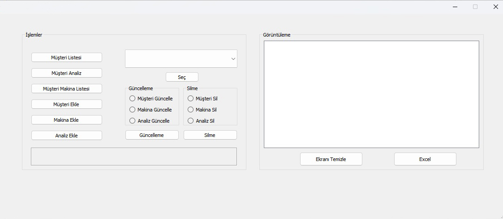
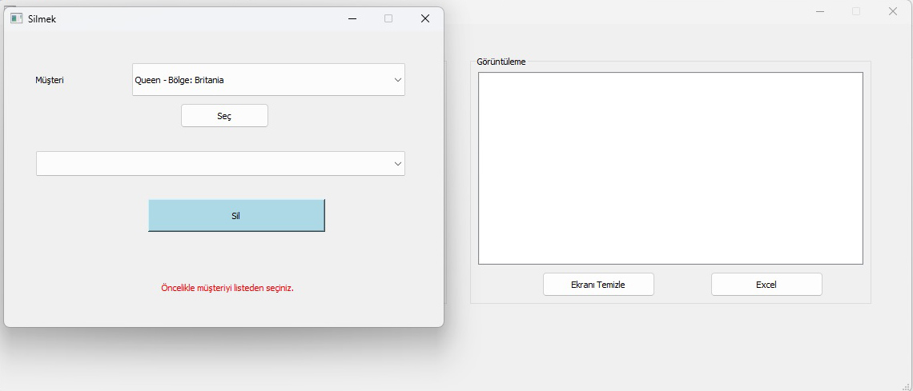
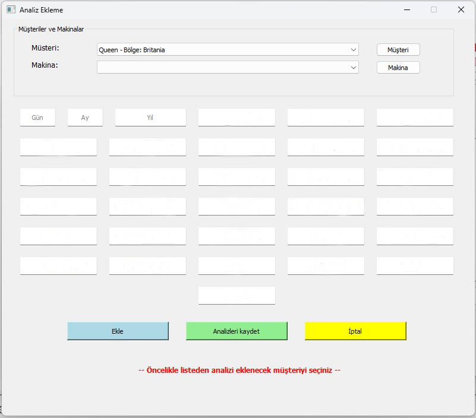

# firstOfMany

A collection of early Python/PyQt code projects — kept here for reference and future cleanup.

This repository contains initial tools and UI modules for a desktop application built with Python and PyQt. It includes forms and logic for basic database-backed workflows such as machine, customer, and analysis management.


---

## 📦 What’s Included

These files represent UI and functionality:

- `.py` modules — core logic (DB manager, models, app entrypoint)
- `.ui` files — Qt Designer UI definitions
- Supporting scripts for importing & exporting data  
- A PyInstaller spec for packaging into an executable

---


## Demo






## 🧠 Motivation

This repo started as a first of many projects intended to explore a Python + Qt desktop workflow, including:

- Building forms and views with Qt Designer
- Connecting UI to Python backend logic
- Managing local data via a database layer
- Exporting desired data as .xlsx

The repo to evolve into a more cohesive product, however, for now it serves as a sandbox and reference point.

---

## 🚀 How to Use

If you want to explore or run the code:

1. Clone the repository  
   ```bash
   git clone https://github.com/nbeser/firstOfMany.git
   cd firstOfMany

2. Create & activate a virtual environment
python -m venv venv
source venv/bin/activate  # or `venv\Scripts\activate` on Windows


python app.py

<p align="right">(<a href="#readme-top">back to top</a>)</p>


<!-- CONTACT -->
## Contact

Nurettin Beşer - [https://www.instagram.com/zcodingsolutions/](https://www.instagram.com/zcodingsolutions/)

Project Link: [https://github.com/nbeser/BudgetProject/](https://github.com/nbeser/firstOfMany/)


Contributer : [https://github.com/nbeser](https://github.com/nbeser)

Linkedin : [https://www.linkedin.com/in/nurettin-beser-arcnbsr23](https://www.linkedin.com/in/nurettin-beser-arcnbsr23)


<p align="right">(<a href="#readme-top">back to top</a>)</p>

